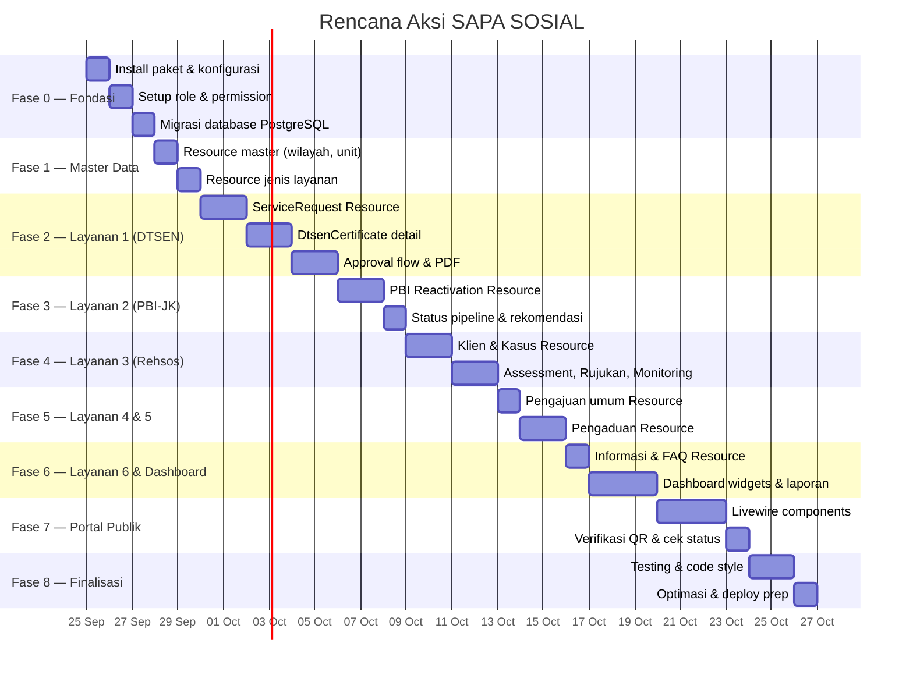

# 🚀 Rencana Aksi — Dashboard Filament v5 SAPA SOSIAL

> **Tanggal:** 25 September 2026
> **Stack:** Laravel 13 · Filament 5.8 · Livewire 4.4 · PostgreSQL · Tailwind CSS 4

---

## Analisis Kondisi Saat Ini

| Komponen | Status |
|----------|--------|
| Models (31 file) | ✅ Lengkap sesuai PRD |
| Enums (10 file) | ✅ Lengkap dengan `label()` bahasa Indonesia |
| Migrations (16 file) | ✅ Lengkap semua tabel PRD |
| Seeders (11 file) | ✅ Master data + sample data |
| Factories | ⚠️ Hanya `UserFactory` |
| Filament Resources | ❌ Belum ada sama sekali |
| Filament Widgets | ❌ Belum ada |
| Policies | ❌ Belum ada |
| spatie/laravel-permission | ❌ Belum diinstall |
| spatie/laravel-activitylog | ❌ Belum diinstall |
| Portal Publik | ❌ Belum ada |
| PDF/Excel/QR packages | ❌ Belum diinstall |

---

## Struktur Fase



---

## Fase 0 — Fondasi & Infrastruktur

> [!IMPORTANT]
> Fase ini WAJIB selesai sebelum memulai Resource apapun.

### 0.1 Install Paket Pendukung

```bash
# Roles & Permissions
composer require spatie/laravel-permission

# Audit Log
composer require spatie/laravel-activitylog

# PDF Generation
composer require barryvdh/laravel-dompdf

# Excel Export (via Filament Export Action atau maatwebsite)
composer require maatwebsite/excel

# QR Code
composer require simplesoftwareio/simple-qrcode
```

**Deliverable:**
- [ ] Semua paket terinstall & kompatibel dengan Filament v5 / Livewire v4
- [ ] Publish & jalankan migration dari spatie packages
- [ ] Tambahkan `HasRoles` trait ke model [User.php](file:///c:/laragon/www/app-layanan/app/Models/User.php)

### 0.2 Setup Roles & Permissions

**File baru:** `database/seeders/RoleAndPermissionSeeder.php`

| Role | Guard | Permissions |
|------|-------|-------------|
| `administrator` | web | `*` (full access) |
| `petugas_dinsos` | web | manage service_requests, complaints, rehabilitation_cases, clients |
| `pejabat_penandatangan` | web | approve dtsen_certificates, approve pbi_reactivations |
| `pimpinan` | web | view dashboard, view reports (read-only) |
| `operator_daerah` | web | create & view service_requests, complaints (scoped by wilayah) |
| `masyarakat` | web | submit service_requests, complaints; view own data |

**Deliverable:**
- [ ] Seeder roles & permissions berjalan sukses
- [ ] Update [DatabaseSeeder.php](file:///c:/laragon/www/app-layanan/database/seeders/DatabaseSeeder.php) memanggil seeder baru
- [ ] Update [UserSeeder.php](file:///c:/laragon/www/app-layanan/database/seeders/UserSeeder.php) assign roles ke sample users

### 0.3 Konfigurasi Panel Admin Filament

**Edit:** [AdminPanelProvider.php](file:///c:/laragon/www/app-layanan/app/Providers/Filament/AdminPanelProvider.php)

```php
return $panel
    ->default()
    ->id('admin')
    ->path('admin')
    ->login()
    ->colors(['primary' => Color::Blue])
    ->brandName('SAPA SOSIAL')
    ->brandLogo(/* logo Dinsos */)
    ->favicon(/* favicon */)
    ->sidebarCollapsibleOnDesktop()
    ->navigationGroups([
        'Layanan DTSEN',
        'Layanan PBI-JK',
        'Rehabilitasi Sosial',
        'Pengajuan & Pengaduan',
        'Informasi Publik',
        'Master Data',
        'Pengaturan',
    ])
    ->databaseNotifications()
    ->globalSearchKeyBindings(['command+k', 'ctrl+k'])
    ->discoverResources(...)
    ->discoverWidgets(...)
    ->discoverPages(...);
```

**Deliverable:**
- [ ] Panel branding, navigasi, dan notifikasi dikonfigurasi
- [ ] Database notifications migration dijalankan

### 0.4 Setup Policies & Global Scopes

**Buat Policy untuk setiap Resource utama:**

| Policy | Model | Scope |
|--------|-------|-------|
| `ServiceRequestPolicy` | `ServiceRequest` | Operator hanya wilayahnya, masyarakat hanya miliknya |
| `ComplaintPolicy` | `Complaint` | Operator hanya wilayahnya |
| `RehabilitationCasePolicy` | `RehabilitationCase` | Hanya petugas yang ditugaskan + admin |
| `ClientPolicy` | `Client` | Data sensitif — hanya petugas terkait |
| `DtsenCertificatePolicy` | `DtsenCertificate` | Pejabat penandatangan + admin |
| `PbiReactivationPolicy` | `PbiReactivation` | Pejabat penandatangan + admin |

**Deliverable:**
- [ ] 6+ Policy files di `app/Policies/`
- [ ] Policies registered di `AuthServiceProvider` atau auto-discovered
- [ ] Global scope untuk Operator (filter village_id/district_id)

### 0.5 Tambahan Model: ActivityLog Trait

**Deliverable:**
- [ ] Tambah `LogsActivity` trait ke semua model transaksional (`ServiceRequest`, `Complaint`, `RehabilitationCase`, `Referral`, `DtsenCertificate`, `PbiReactivation`)
- [ ] Konfigurasi attribute yang dilog

---

## Fase 1 — Master Data Resources

### 1.1 Resource: WorkUnit (Unit Kerja)

**Path:** `app/Filament/Resources/WorkUnitResource.php`

| Komponen | Detail |
|----------|--------|
| Table columns | `name`, `is_active` (badge), jumlah users |
| Form fields | `name` (TextInput), `is_active` (Toggle) |
| Actions | Create, Edit, Delete (soft) |
| Navigation | Group: "Master Data" |

### 1.2 Resource: District & Village (Kecamatan & Desa)

**Path:** `app/Filament/Resources/DistrictResource.php` + `VillageResource.php`

| Komponen | Detail |
|----------|--------|
| District Table | `code`, `name`, jumlah desa |
| Village Table | `code`, `name`, `district.name` (filter) |
| Relation Manager | `DistrictResource` → `VillagesRelationManager` |

### 1.3 Resource: ServiceType (Jenis Layanan)

**Path:** `app/Filament/Resources/ServiceTypeResource.php`

| Komponen | Detail |
|----------|--------|
| Table | `code`, `name`, `category` (badge), `handler`, `sla_days`, `is_active` |
| Form | Semua field + Toggle `needs_assessment` |
| Relation Manager | `ServiceRequirementsRelationManager` |

### 1.4 Resource: DtsenPurpose (Tujuan SK DTSEN)

| Komponen | Detail |
|----------|--------|
| Table | `code`, `name`, `max_decile`, `validity_days`, `is_active` |
| Form | Semua field, `max_decile` 1–10 Select |

### 1.5 Resources Pendukung

- [ ] `ComplaintCategoryResource` — CRUD kategori pengaduan
- [ ] `ClientCategoryResource` — CRUD kategori klien rehsos
- [ ] `ReferralInstitutionResource` — CRUD lembaga rujukan
- [ ] `UserResource` — kelola pengguna + assign roles (via spatie)

**Deliverable Fase 1:**
- [ ] 8+ Filament Resources untuk master data
- [ ] Semua Resource memiliki search, filter, dan pagination
- [ ] Navigation groups terorganisir

---

## Fase 2 — Layanan 1: Surat Keterangan DTSEN ⭐

> [!IMPORTANT]
> Layanan prioritas utama — menjadi template pola untuk layanan lain.

### 2.1 Resource: ServiceRequest (filtered by handler=dtsen)

**Path:** `app/Filament/Resources/DtsenRequestResource.php`

Gunakan `getEloquentQuery()` untuk filter `service_type.handler = 'dtsen'`.

#### Table Columns
| Column | Type |
|--------|------|
| `request_number` | Searchable, copyable |
| `applicant_name` | Searchable |
| `applicant_nik` | Searchable |
| `village.name` + `village.district.name` | Stacked |
| `dtsenCertificate.dtsenPurpose.name` | Badge |
| `status` | Badge warna per status |
| `is_priority` | Icon boolean |
| `submitted_at` | Date, sortable |
| `officer.name` | — |

#### Filters
- `status` (SelectFilter multi)
- `dtsenPurpose` (SelectFilter)
- `village.district_id` (SelectFilter → cascade ke village)
- `village_id` (SelectFilter)
- `submitted_at` (DateFilter range)
- `is_priority` (TernaryFilter)

#### Table Actions (per-row)
| Action | Kondisi | Efek |
|--------|---------|------|
| Verifikasi Berkas | status = `submitted` | → `document_check` |
| Minta Perbaikan | status = `document_check` | → `revision_requested` + notes |
| Cek SIKS-NG | status = `document_check` | Buka form cek data → `data_verification` |
| Ajukan Persetujuan | `data_verification` + cek desil valid | → `awaiting_approval` |
| Tolak | `document_check` / `data_verification` | → `rejected` + alasan |

> Setiap action membuat entry di `status_histories`.

### 2.2 DTSEN Certificate Detail (RelationManager / Form Section)

#### Form Sections di dalam DtsenRequestResource
```
📋 Data Pemohon
├── applicant_name, applicant_nik, family_card_number
├── address, village_id (dependent select), phone
│
📋 Data yang Diterangkan
├── subject_name, subject_nik, relationship_to_applicant
├── dtsen_purpose_id, purpose_description
│
📋 Dokumen Persyaratan
├── Repeater: service_request_documents
│   ├── requirement (select), file_path (upload), status (badge)
│
📋 Hasil Cek SIKS-NG (tampil setelah document_check)
├── is_registered (toggle), decile (select 1-10)
├── checked_at (datetime), checker_id (auto current user)
│
📋 Penerbitan Surat (tampil setelah approval)
├── certificate_number (auto-generate), issued_at, valid_until
├── signer_id (select pejabat), file_path (generated PDF)
├── verification_code (auto UUID/hash)
```

### 2.3 Approval Flow (Persetujuan Berjenjang)

**Custom Page atau Action Modal:**

```
Step 1: Kabid — Paraf
  ├── approve → step 2
  └── return → revision_requested (notes)

Step 2: Kadis — Tanda Tangan
  ├── approve → issued (generate PDF + nomor surat)
  └── return → step 1 (notes)
```

**Resource khusus:** `ApprovalQueueResource.php`
- Menampilkan daftar DTSEN & PBI yang `awaiting_approval`
- Filtered by `approver_id = auth()->id()`
- Bulk approve action

### 2.4 Generate PDF SK DTSEN

**File:** `app/Services/DtsenCertificateService.php`

| Fitur | Detail |
|-------|--------|
| Template | Blade view → DomPDF |
| QR Code | `simplesoftwareio/simple-qrcode` → URL `/verifikasi/{code}` |
| Nomor Surat | Via `NumberSequence` model dengan `lockForUpdate()` |
| Storage | Disk `local` (private), akses via signed URL |

### 2.5 Duplikasi Warning

**File:** `app/Services/DuplicateCheckService.php`

- Cek saat pembuatan baru: pemohon + tujuan sama + surat masih berlaku
- Tampilkan warning banner di form jika ditemukan

**Deliverable Fase 2:**
- [ ] `DtsenRequestResource` dengan table, form, filters, actions
- [ ] Approval flow berjenjang (Kabid → Kadis)
- [ ] PDF generation + QR code
- [ ] Auto-numbering SK DTSEN
- [ ] Duplikasi warning
- [ ] Status transition + `status_histories` otomatis
- [ ] 📝 Feature tests untuk alur lengkap

---

## Fase 3 — Layanan 2: Reaktivasi KIS/PBI-JK ⭐

### 3.1 Resource: PbiReactivationRequest

**Path:** `app/Filament/Resources/PbiRequestResource.php`

Pola sama dengan DTSEN, filter `service_type.handler = 'pbi'`.

#### Perbedaan kunci dari DTSEN:

| Aspek | Detail |
|-------|--------|
| Form tambahan | `participant_name`, `participant_nik`, `bpjs_card_number`, `deactivated_date`, `reason` (Select enum), `health_facility_name`, `health_letter_number` |
| Validasi | Alasan medis → `health_letter_number` wajib |
| Status pipeline | Lebih panjang: sampai `proposed_to_ministry` → `ministry_approved` → `reactivated` |
| Priority flag | `reason = emergency` → auto `is_priority = true`, muncul paling atas |
| Stale indicator | `proposed_to_ministry` > N hari → badge "Perlu Ditindaklanjuti" |

### 3.2 Status Tracking Tambahan

| Action | Status To | Required Fields |
|--------|-----------|-----------------|
| Input Usulan SIKS-NG | `proposed_to_ministry` | `proposed_to_ministry_at` |
| Catat Keputusan Kemensos | `ministry_approved` / `ministry_rejected` | `ministry_decision`, `ministry_decided_at` |
| Konfirmasi Aktif Kembali | `reactivated` | `reactivated_date` |
| Selesai | `completed` | — |

### 3.3 Surat Rekomendasi PDF

- Template berbeda dari DTSEN
- Nomor rekomendasi via `NumberSequence`
- Approval berjenjang sama (pakai `approvals` polimorfik)

**Deliverable Fase 3:**
- [ ] `PbiRequestResource` lengkap
- [ ] Status pipeline 10 tahap
- [ ] Priority flag untuk darurat medis
- [ ] Stale ticket indicator
- [ ] Surat rekomendasi PDF
- [ ] 📝 Feature tests

---

## Fase 4 — Layanan 3: Rehabilitasi Sosial ⭐

### 4.1 Resource: Client (Klien Rehsos)

**Path:** `app/Filament/Resources/ClientResource.php`

> [!WARNING]
> Data sensitif — akses dibatasi via `ClientPolicy`.

| Komponen | Detail |
|----------|--------|
| Table | `name`, `client_category.name`, `nik` (masked), `village`, `gender` |
| Form | Identity fields + `client_category_id` |
| Filters | `client_category_id`, `village.district_id` |

### 4.2 Resource: RehabilitationCase (Kasus Rehsos)

**Path:** `app/Filament/Resources/RehabilitationCaseResource.php`

#### Table Columns
`case_number`, `client.name`, `client.clientCategory.name`, `officer.name`, `handling_type` (badge), `status` (badge), `received_at`, source info

#### Form Sections
```
📋 Data Kasus
├── case_number (auto), client_id (select/create)
├── source: service_request_id (optional) / complaint_id (optional)
├── officer_id, handling_type, received_at

📋 Assessment (RelationManager)
├── assessment_date, result (textarea), service_needs
├── recommendation, needs_referral (toggle)

📋 Rujukan (RelationManager, jika needs_referral)
├── referral_number (auto), referral_institution_id
├── officer_id, referral_date, status

📋 Monitoring (RelationManager)
├── monitoring_date, progress, result_notes, officer_id
├── referral_id (optional, jika monitoring rujukan)

📋 Hasil Penanganan
├── handling_result (wajib sebelum closed)
```

#### Relation Managers
- `AssessmentsRelationManager`
- `ReferralsRelationManager`
- `MonitoringRecordsRelationManager`

#### Status Actions
| Action | From | To | Validasi |
|--------|------|----|----------|
| Mulai Assessment | `received` | `assessment` | — |
| Tetapkan Rencana | `assessment` | `service_planning` | Assessment harus ada |
| Mulai Pelayanan | `service_planning` | `in_service` | Rencana tercatat |
| Monitoring | `in_service` | `monitoring` | — |
| Tutup Kasus | `monitoring` | `closed` | `handling_result` wajib diisi |

### 4.3 Resource: Referral (Rujukan)

Bisa standalone Resource atau RelationManager saja.

- Status tracking sendiri: `draft` → `sent` → `accepted` → `in_service` → `completed`
- Validasi: hanya bisa dibuat jika assessment ada dengan `needs_referral = true`

**Deliverable Fase 4:**
- [ ] `ClientResource` dengan data masking
- [ ] `RehabilitationCaseResource` dengan 3 RelationManagers
- [ ] Status tracking kasus & rujukan
- [ ] Validasi business rules (assessment sebelum rencana, dll.)
- [ ] 📝 Feature tests

---

## Fase 5 — Layanan 4 & 5: Pengajuan Umum & Pengaduan

### 5.1 Resource: GenericServiceRequest (Pengajuan Umum)

**Path:** `app/Filament/Resources/GenericRequestResource.php`

Filter `service_type.handler = 'generic'`.

- Dynamic form berdasarkan `service_type.needs_assessment`
- Persyaratan dokumen berdasarkan `service_requirements` dari jenis layanan
- Status pipeline: `submitted` → ... → `completed`
- Aksi: buat kasus rehsos dari pengajuan (link ke Layanan 3)

### 5.2 Resource: Complaint (Pengaduan Sosial)

**Path:** `app/Filament/Resources/ComplaintResource.php`

#### Table
`complaint_number`, `reporter_name`, `complaint_category.name`, `village.district.name`, `status` (badge), `reported_at`, `officer.name`

#### Form Sections
```
📋 Data Laporan
├── complaint_number (auto), complaint_category_id
├── reporter_name, reporter_phone, reporter_id (optional, jika user login)
├── location_detail (textarea), village_id (dependent select)
├── description (RichEditor), reported_at

📋 Lampiran (RelationManager)
├── file_path (upload), type (photo/document)

📋 Penanganan
├── verification_result, action_taken
├── officer_id (assign), duplicate_of_id (optional)
```

#### Status Actions
| Action | From | To | Notes |
|--------|------|----|-------|
| Verifikasi | `received` | `verification` | — |
| Minta Klarifikasi | `verification` | `clarification_requested` | Catatan wajib |
| Disposisi | `verification` | `dispatched` | Pilih unit/petugas |
| Tangani | `dispatched` | `in_handling` | — |
| Buat Kasus Rehsos | `in_handling` | — | Link ke Layanan 3 |
| Selesai | `in_handling` | `resolved` | `action_taken` wajib |
| Duplikat | any | `duplicate` | Pilih laporan induk |
| Tidak Valid | `verification` | `invalid` | Alasan wajib |

### 5.3 Disposisi (Lintas Modul)

**Komponen reusable:** `DispositionAction.php`

- Modal: pilih `to_work_unit_id`, `to_user_id` (optional), `instructions`
- Buat record di `dispositions`
- Kirim notification ke petugas/unit tujuan

**Deliverable Fase 5:**
- [ ] `GenericRequestResource`
- [ ] `ComplaintResource` dengan status pipeline
- [ ] `ComplaintAttachmentsRelationManager`
- [ ] Disposisi action (reusable)
- [ ] Duplikasi marking untuk pengaduan
- [ ] 📝 Feature tests

---

## Fase 6 — Layanan 6: Informasi & Dashboard

### 6.1 Resource: InformationPage

**Path:** `app/Filament/Resources/InformationPageResource.php`

| Komponen | Detail |
|----------|--------|
| Table | `title`, `category` (badge), `publish_status` (badge), `published_at`, `manager.name` |
| Form | `title`, `slug` (auto from title), `category`, `service_type_id`, RichEditor fields, `publish_status` |
| RelationManagers | `DownloadableFormsRelationManager`, `FaqsRelationManager` |
| Actions | Publish / Archive (status transition) |

### 6.2 Resource: FAQ

Standalone + RelationManager pada `InformationPage`.

### 6.3 Dashboard Widgets 📊

> [!IMPORTANT]
> Semua widget wajib support filter: **periode, jenis layanan, status, kecamatan, desa**.
> Operator Kecamatan/Desa hanya melihat data wilayahnya.

**Path:** `app/Filament/Widgets/`

| Widget | Tipe | Deskripsi |
|--------|------|-----------|
| `DtsenIssuedStatsWidget` | StatsOverview | Jumlah SK terbit per tujuan & desil |
| `DtsenAwaitingApprovalWidget` | Table | Antrean draf menunggu paraf/TTD |
| `PbiPerStageWidget` | StatsOverview | Jumlah per status PBI + tertahan |
| `PbiEmergencyWidget` | Table | Pengajuan darurat medis belum selesai |
| `RehabActiveCasesWidget` | StatsOverview | Kasus aktif, per stage, rujukan per lembaga |
| `IncomingRequestsWidget` | Chart (Bar) | Pengajuan & pengaduan baru per periode |
| `ProcessedVsCompletedWidget` | Chart (Doughnut) | Dalam proses vs selesai |
| `RegionalDistributionWidget` | Chart (Bar) / Table | Sebaran per kecamatan/desa |
| `TopInfoPagesWidget` | Table | *(opsional)* Konten paling sering diakses |

#### Dashboard Filter

Buat custom **Dashboard Page** (`app/Filament/Pages/Dashboard.php`) yang meng-override default:

```php
class Dashboard extends \Filament\Pages\Dashboard
{
    // Override untuk menambahkan filter global
    // Filter: periode (date range), jenis layanan, status, kecamatan, desa
    // Widget menerima filter via $this->filters
}
```

### 6.4 Laporan Berkala (Export)

**Path:** `app/Filament/Pages/Reports/`

| Laporan | Page | Export |
|---------|------|--------|
| Rekap SK DTSEN | `DtsenReportPage` | Excel & PDF |
| Rekap Reaktivasi PBI-JK | `PbiReportPage` | Excel & PDF |
| Laporan Rehabilitasi Sosial | `RehabReportPage` | Excel & PDF |
| Laporan Pelayanan (semua) | `ServiceReportPage` | Excel & PDF |
| Laporan Pengaduan | `ComplaintReportPage` | Excel & PDF |

Setiap halaman laporan memiliki:
- Filter periode, wilayah, status, jenis layanan
- Preview tabel di halaman
- Tombol export Excel (via Filament Export Action / maatwebsite)
- Tombol export PDF (via DomPDF)
- Queue job untuk laporan besar

**Deliverable Fase 6:**
- [ ] `InformationPageResource` + relation managers
- [ ] `FaqResource`
- [ ] 9 Dashboard Widgets dengan filter
- [ ] Custom Dashboard Page dengan global filter
- [ ] 5 Report Pages dengan export Excel & PDF
- [ ] Queue setup untuk export besar

---

## Fase 7 — Portal Publik (Livewire v4)

### 7.1 Layout & Routing

**Routes:** `routes/web.php`

```php
Route::get('/', HomePage::class);                      // Landing
Route::get('/layanan', ServiceListPage::class);         // Daftar layanan
Route::get('/layanan/{slug}', ServiceDetailPage::class); // Detail + form
Route::get('/pengajuan/{type}', SubmissionForm::class);  // Form pengajuan
Route::get('/pengaduan', ComplaintForm::class);          // Form pengaduan
Route::get('/cek-status', StatusCheckPage::class);       // Cek status tiket
Route::get('/verifikasi/{code}', VerifyCertificatePage::class); // QR verify
Route::get('/faq', FaqPage::class);                     // FAQ
```

### 7.2 Komponen Livewire v4

| Komponen | Fitur |
|----------|-------|
| `HomePage` | Hero, daftar layanan singkat, link pengajuan/pengaduan |
| `ServiceListPage` | Grid layanan, pencarian kata kunci, filter kategori |
| `ServiceDetailPage` | Informasi lengkap, persyaratan, alur, formulir unduhan |
| `SubmissionForm` | Form pengajuan dinamis per jenis layanan (boleh pakai Filament Schemas + `HasSchemas` / `InteractsWithSchemas`) |
| `ComplaintForm` | Form pengaduan + upload lampiran |
| `StatusCheckPage` | Input nomor tiket + 4 digit NIK/HP → tampil timeline status |
| `VerifyCertificatePage` | Input kode / scan QR → tampil status keaslian & data surat |
| `FaqPage` | Accordion FAQ, pencarian |

### 7.3 Catat Statistik

- `PageVisit` — increment pada setiap kunjungan halaman informasi
- `SearchLog` — catat setiap pencarian kata kunci

**Deliverable Fase 7:**
- [ ] Layout publik (header, footer, responsive)
- [ ] 8 Livewire full-page components
- [ ] Form pengajuan dinamis per jenis layanan
- [ ] Cek status tiket (tanpa login)
- [ ] Verifikasi keaslian SK DTSEN via QR
- [ ] 📝 Feature tests form submission & status check

---

## Fase 8 — Testing, Finalisasi & Deploy Prep

### 8.1 Factories

Buat factory untuk setiap model transaksional:

| Factory | States |
|---------|--------|
| `ServiceRequestFactory` | `submitted`, `document_check`, `completed`, `rejected` |
| `DtsenCertificateFactory` | `pending`, `issued` |
| `PbiReactivationFactory` | `pending`, `ministry_approved`, `reactivated` |
| `ComplaintFactory` | `received`, `dispatched`, `resolved` |
| `RehabilitationCaseFactory` | `received`, `in_service`, `closed` |
| `ClientFactory` | default |
| `ReferralFactory` | `draft`, `sent`, `completed` |

### 8.2 Feature Tests

| Test Suite | Coverage |
|------------|----------|
| Alur SK DTSEN end-to-end | Submit → approval → issued → PDF generated |
| Alur PBI-JK end-to-end | Submit → ministry → reactivated |
| Alur Rehsos end-to-end | Case → assessment → referral → monitoring → closed |
| Alur Pengaduan | Report → verify → dispatch → resolve |
| Access control | Setiap role hanya bisa akses sesuai permission |
| Business rules | Desil validation, mandatory docs, duplicate check |
| Portal publik | Form submission, status check, QR verify |
| Dashboard widgets | Data accuracy dengan filter |

### 8.3 Code Style & Quality

```bash
# Laravel Pint
vendor/bin/pint --dirty --format agent

# PHPStan / Larastan (jika ditambahkan)
vendor/bin/phpstan analyse
```

### 8.4 Optimasi & Deploy Prep

- [ ] Database indexes pada kolom filter (sudah di migration, verifikasi)
- [ ] Queue worker config untuk PDF/Excel generation
- [ ] `php artisan config:cache`, `route:cache`, `view:cache`
- [ ] `.env.production` settings (APP_DEBUG=false, dll.)
- [ ] Backup strategy untuk PostgreSQL
- [ ] File storage: verifikasi disk `local` (private) untuk dokumen
- [ ] Timezone: `Asia/Jakarta` di `config/app.php`

**Deliverable Fase 8:**
- [ ] 7+ Factory files dengan states
- [ ] 20+ Feature test files
- [ ] Code style clean (Pint passed)
- [ ] Optimasi query (N+1 check)
- [ ] Deploy checklist ✅

---

## Ringkasan Struktur File Baru

```
app/
├── Filament/
│   ├── Resources/
│   │   ├── WorkUnitResource.php
│   │   ├── DistrictResource.php
│   │   ├── VillageResource.php
│   │   ├── ServiceTypeResource.php
│   │   ├── DtsenPurposeResource.php
│   │   ├── ComplaintCategoryResource.php
│   │   ├── ClientCategoryResource.php
│   │   ├── ReferralInstitutionResource.php
│   │   ├── UserResource.php
│   │   ├── DtsenRequestResource.php          ← Layanan 1
│   │   ├── PbiRequestResource.php            ← Layanan 2
│   │   ├── ClientResource.php                ← Layanan 3
│   │   ├── RehabilitationCaseResource.php    ← Layanan 3
│   │   ├── GenericRequestResource.php        ← Layanan 4
│   │   ├── ComplaintResource.php             ← Layanan 5
│   │   ├── InformationPageResource.php       ← Layanan 6
│   │   ├── FaqResource.php                   ← Layanan 6
│   │   └── ApprovalQueueResource.php         ← Lintas modul
│   ├── Widgets/
│   │   ├── DtsenIssuedStatsWidget.php
│   │   ├── DtsenAwaitingApprovalWidget.php
│   │   ├── PbiPerStageWidget.php
│   │   ├── PbiEmergencyWidget.php
│   │   ├── RehabActiveCasesWidget.php
│   │   ├── IncomingRequestsWidget.php
│   │   ├── ProcessedVsCompletedWidget.php
│   │   ├── RegionalDistributionWidget.php
│   │   └── TopInfoPagesWidget.php
│   └── Pages/
│       ├── Dashboard.php                     ← Custom dashboard + filter
│       └── Reports/
│           ├── DtsenReportPage.php
│           ├── PbiReportPage.php
│           ├── RehabReportPage.php
│           ├── ServiceReportPage.php
│           └── ComplaintReportPage.php
├── Livewire/                                 ← Portal Publik
│   ├── HomePage.php
│   ├── ServiceListPage.php
│   ├── ServiceDetailPage.php
│   ├── SubmissionForm.php
│   ├── ComplaintForm.php
│   ├── StatusCheckPage.php
│   ├── VerifyCertificatePage.php
│   └── FaqPage.php
├── Policies/
│   ├── ServiceRequestPolicy.php
│   ├── ComplaintPolicy.php
│   ├── RehabilitationCasePolicy.php
│   ├── ClientPolicy.php
│   ├── DtsenCertificatePolicy.php
│   └── PbiReactivationPolicy.php
├── Services/
│   ├── DtsenCertificateService.php
│   ├── PbiRecommendationService.php
│   ├── DuplicateCheckService.php
│   ├── NumberingService.php
│   └── StatusTransitionService.php
└── Actions/                                  ← Reusable Filament Actions
    ├── ApproveAction.php
    ├── DispositionAction.php
    ├── TransitionStatusAction.php
    └── RequestRevisionAction.php
```

---

## Urutan Eksekusi yang Disarankan

> [!TIP]
> Jika ingin paralel, Fase 3 & 4 bisa dikerjakan bersamaan setelah Fase 2 selesai karena pola sudah established.

| # | Fase | Perkiraan | Dependensi |
|---|------|-----------|------------|
| 0 | Fondasi & Infrastruktur | 3 hari | — |
| 1 | Master Data Resources | 2 hari | Fase 0 |
| 2 | Layanan 1 (DTSEN) ⭐ | 6 hari | Fase 1 |
| 3 | Layanan 2 (PBI-JK) ⭐ | 3 hari | Fase 2 (pola sama) |
| 4 | Layanan 3 (Rehsos) ⭐ | 4 hari | Fase 1 |
| 5 | Layanan 4 & 5 (Pengajuan + Pengaduan) | 3 hari | Fase 2 |
| 6 | Layanan 6 & Dashboard | 4 hari | Fase 2–5 |
| 7 | Portal Publik | 4 hari | Fase 1–6 |
| 8 | Testing & Finalisasi | 3 hari | Semua fase |
| | **Total estimasi** | **~32 hari kerja** | |

---

> [!NOTE]
> Rencana ini mengacu sepenuhnya pada [PRD SAPA SOSIAL](file:///c:/laragon/www/app-layanan/PRD_SAPA_SOSIAL.md). Tidak ada fitur di luar scope PRD yang ditambahkan. Setiap fase menghasilkan deliverable yang dapat diverifikasi sebelum lanjut ke fase berikutnya.
